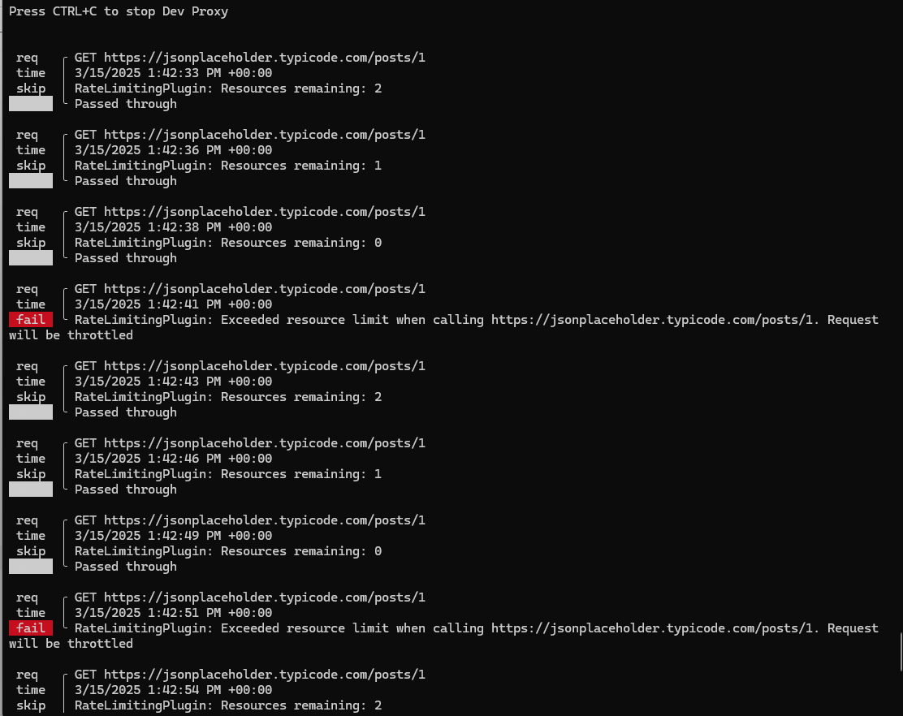

# Rate Limit Plugin  Plus reporting

While you can certainly return 429 from any custom error file, this plugin is better at simulating a real world rate limiting scenario.

Given the following config...

```
1. {
2.    "$schema": "https://raw.githubusercontent.com/dotnet/dev-proxy/main/schemas/v0.25.0/rc.schema.json",
3.    "plugins": [
4.        {
5.            "name": "RateLimitingPlugin",
6.            "enabled": true,
7.            "pluginPath": "~appFolder/plugins/dev-proxy-plugins.dll",
8.            "configSection": "rateLimiting"
9.        }
10.    ],
11.     "rateLimiting": {
12.        "costPerRequest": 1,
13.        "rateLimit": 3,
14.        "resetTimeWindowSeconds" : 10
15.    },
16.    "urlsToWatch": [
17.        "https://jsonplaceholder.typicode.com/*"
18.    ],
19.    "logLevel": "information",
20.    "newVersionNotification": "stable",
21.    "showSkipMessages": true
22. }
```

... requests will be throttled if you exceed more than 3 per 10 second sliding window. 

Run [requests.ps1](requests.ps1) and observe how "Resources remaining" goes down until you have none left, at which point you get throttled. Every 10 seconds your allotment resets.



A simple error response would not simulate this behavior.

## How It Works

- **Cost Per Request**: How many “credits” each request consumes.  
- **Rate Limit**: The maximum number of credits you can use within the specified time window.  
- **Reset Time Window**: The time (in seconds) after which your credits are replenished.  

## Usage Tips

1. **Local Development**  
   - Edit the `rateLimit` parameters in your configuration based on your needs.  
2. **Monitoring**  
   - Use logs to see when you’ve reached the request limit.  
3. **Handling 429 Errors**  
   - If throttled, you’ll receive a `429 Too Many Requests` response. You can then retry after the reset interval.  