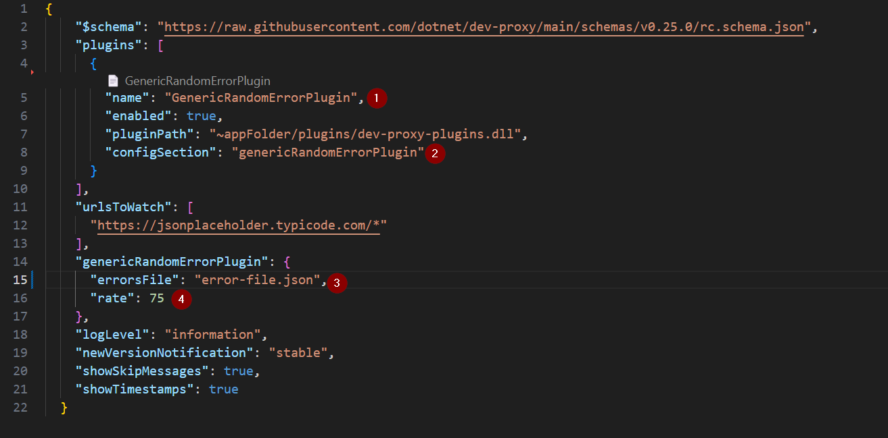

# Custom Random Error

The default configuration that ships with Dev Proxy has a wide range of errors that can be randomly returned. This example just demonstrates how you can easily create your own.

By creating a [file with your desired responses](error-file.json) and referencing it within the [devproxyrc.json](devproxyrc.json), you can simulate random errors of your choosing.

1. Instructing Dev Proxy to use the Generic Random Error plugin.
1. Defining the name of the section that configures the plugin.
1. Defining the file that contains the actual errors to respond with.
1. Defining the rate at which errors vs success will be returned.

Execute [requests.ps1](requests.ps1) repeatedly and you will see a variety of responses, including approximately 25% success rate. The [errors file](error-file.json) is configured with two error responses, each listenting for different URLs. If you make a request to /users you get either 401, 403 or passthru success. If you make a request to /todos you can get a 418, 429, 500 or passthru success.

## Additional Tips

- **Adjust Error Frequency**: Modify the success rate to match different testing scenarios.  
- **Expand Error File**: Include more custom HTTP status codes or messages in `error-file.json`.  
- **Combine Plugins**: Use the Random Error plugin alongside others (like RateLimitingPlugin) to simulate complex scenarios.  
- **Logging**: Check Dev Proxy’s logs for detailed information on which error responses were triggered and when.
